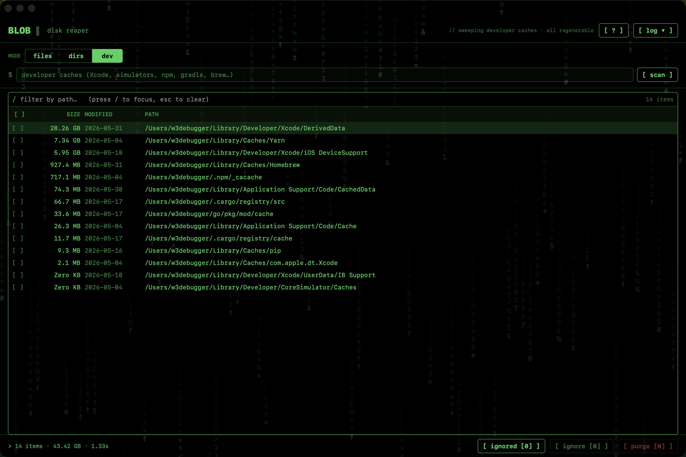

# BLOB ▌

A tiny, native macOS disk reaper. Three honest modes, no daemons, no telemetry. Everything it deletes, it can name, and it moves to the Trash, never a blind delete.



## Modes

- **files** — the biggest individual files under any folder you point it at.
- **dirs** — fat folders by name (`node_modules`, `build`, `target`, `.gradle`, ...), ranked by total recursive size.
- **dev** — regenerable developer caches: Xcode DerivedData and simulators, npm / yarn / pnpm, gradle, cargo, Homebrew. Only caches that rebuild themselves, never your archives or data.

## Build and run

Requires macOS 14 or later and a Swift 5.9 toolchain (Xcode 15+).

```bash
swift run Blob      # quick dev loop
```

Or open `Blob.xcodeproj`, set your signing team under Signing and Capabilities, and press Run. For distribution, use Product > Archive > Direct Distribution (Developer ID), which notarizes through Xcode.

## Website

The landing page lives in [`docs/`](docs/) and is served via GitHub Pages.

## License

[MIT](LICENSE).
